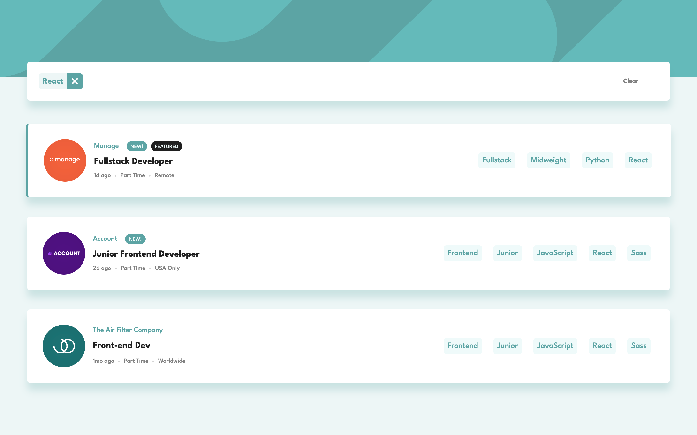
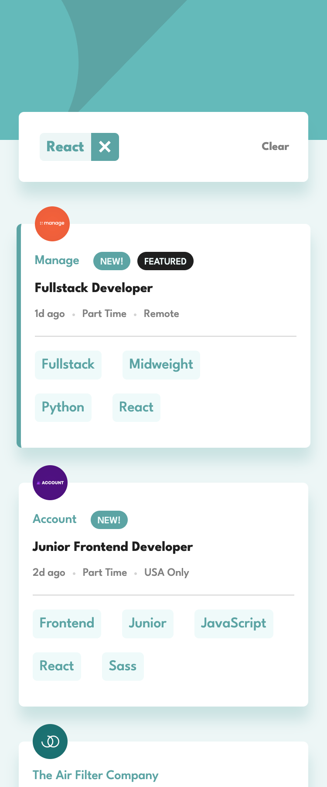

# Job listing app

  
  

## Overview

_A lightweight app to display a list of jobs._

 

## Links

<a href="https://github.com/AngeliqueDF/job-listings-app-react-typescript">GitHub repo</a> • <a href="/.github/CONTRIBUTING.md">Live demo</a>

 

## How to run the project

1. `git clone https://github.com/AngeliqueDF/job-listings-app-react-typescript.git MY_FOLDER_NAME`
2. `cd MY_FOLDER_NAME`
3. `npm install`
4. `npm start`
5. visit `http://localhost:3000`

 

## Features

- View a list of jobs.
- Filter jobs by keyword.
- Responsive.

  

## Technologies

- React
- TypeScript

 

## Author

- [@AngeliqueDF on GitHub.](https://github.com/AngeliqueDF)
- [Visit my website.](https://adf.dev)
- [View my Frontend Mentor profile.](https://www.frontendmentor.io/profile/AngeliqueDF)
